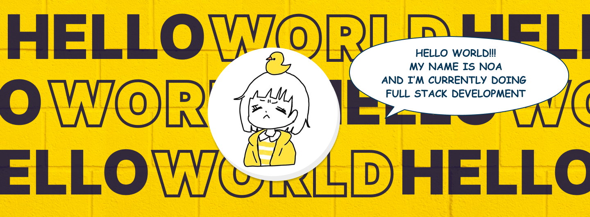

<!--
**noaysk/noaysk** is a ✨ _special_ ✨ repository because its `README.md` (this file) appears on your GitHub profile.

Here are some ideas to get you started:

- 🔭 I’m currently working on ...
- 🌱 I’m currently learning ...
- 👯 I’m looking to collaborate on ...
- 🤔 I’m looking for help with ...
- 💬 Ask me about ...
- 📫 How to reach me: ...
- 😄 Pronouns: ...
- ⚡ Fun fact: ...
-->
## Hey!!! 👋
 

I'm Noa! 
- <i>Currently:</i> Working in Tokyo as a Back-End Developer 
- <i>Previously:</i> Full Stack Developer

<h2>💻 I'm Currently working on</h2>

- System Design
- Software Engineering

<h2> About noaysk⚡:</h2>

Noa is a full-stack software developer with experience in designing, developing, testing, and maintaining various applications. I have a proven track record of effective communication with clients, enabling me to understand their needs and contribute to their satisfaction. My experience working in project teams has honed my teamwork skills, and I have a demonstrated ability to adapt to various tools and approaches tailored to the specific needs of clients and projects.
 
🔭 Check out my portfolio: [noasportfolio.vercel.app](https://noasportfolio.vercel.app/)

